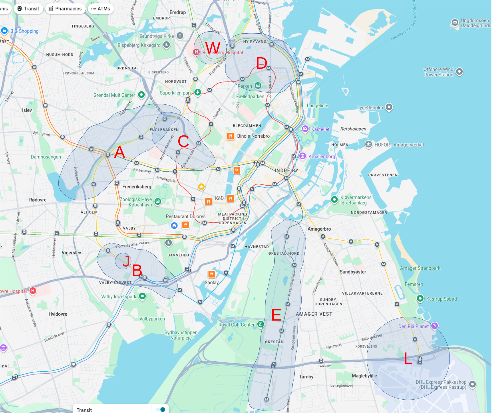

## Mapa s legendou

<a href="images/map.png" target="_blank">
{width=80%}
</a>

| Symbol | Popis |
|--------|-------|
| W | Praca (Symbion) |
| J | Judo |
| L | Letisko |
| {width=12%} | Metro stanica|
| {width=10%} | Stanica mestskeho vlaku |

**A (Vanløse, Grøndal)**  
✅ pri F vlaku, priamy spoj do práce aj na judo, blízko bicyklom  
✅ blizko je dopravny uzol kde sa stretavaju metra aj vlaky  
✅ menej husto obývané = lepšie výhľady na stromy, domy  
❌ staršie, lacnejsie byty

**B (Valby)**  
✅ novostavby, rastúca dobrá štvrť  
✅ blízko F vlaku, juda, M4 metra (do centra)  
❌ príliš ďaleko na bicyklovanie do práce

**C (Frederiksberg)**  
✅ drahé byty, ale dobré investície  
✅ pomerne centrálne, blízko všade, velmi pekna stvrt  
❌ drahé a staršie byty, hustá výstavba

**D (Østerbro, pár kolegov tu býva)**  
✅ veľmi blízko práce aj do centra, blízko metra aj vlakov  
✅ blízko parku aj oceánu  
❌ veľmi drahé staré byty  
❌ husto osídlené (zlé výhľady)

**E (Amager)**  
✅ veľmi lacné novostavby a je ich veľa  
✅ blízko metra do centra aj na letisko  
❌ veľmi ďaleko od všetkého

